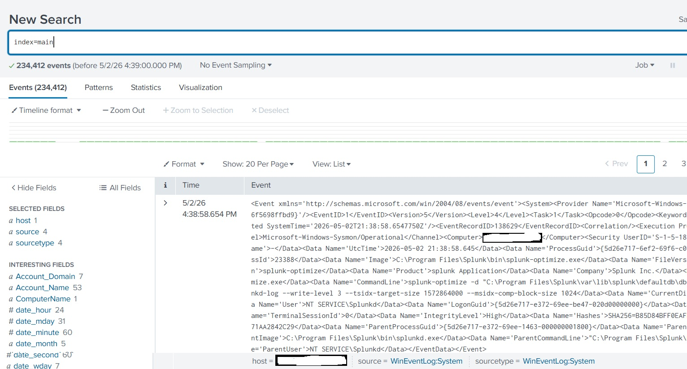

# Windows Endpoint Monitoring with Splunk and Sysmon

This is a beginner SOC lab using Sysmon and Splunk to collect and analyze Windows endpoint logs.

This project focuses on setting up Splunk Enterprise on Windows and preparing it to collect Windows Event Logs and Sysmon logs for basic endpoint monitoring.

## Installing Splunk Enterprise

I installed Splunk Enterprise on my Windows machine to collect and analyze endpoint logs.

Splunk Enterprise was downloaded from the official Splunk website as a Windows 64-bit MSI installer.

During installation, I selected the local system option for the Splunk service and created an admin username and password.

After installation, I opened Splunk locally in the browser using:

```text
http://localhost:8000
```
### Screenshot: Splunk Enterprise Running


## Setting Up Sysmon

After installing Splunk, I moved to the next step: setting up Sysmon on my Windows machine.

Sysmon was downloaded from the official Microsoft Sysinternals page. The file came as a ZIP folder, so I extracted it before installation.

I extracted Sysmon to the following folder:

```text
C:\Users\<your username>\OneDrive\Downloads\Sysmon
```

After extraction, the Sysmon folder contained the required files:

```text
Sysmon.exe
Sysmon64.exe
Sysmon64a.exe
Eula.txt
```

This confirmed that Sysmon was extracted successfully and was ready for installation using PowerShell or Command Prompt.

## Installing Sysmon from Command Prompt

Sysmon is not installed by double-clicking the file. It needs to be installed using PowerShell or Command Prompt with administrator permissions.

I opened Command Prompt as Administrator and navigated to the extracted Sysmon folder:

```cmd
cd "C:\Users\<your username>\OneDrive\Downloads\Sysmon"
```

Then I checked the extracted files using:

```cmd
dir
```

After confirming that `Sysmon64.exe` was available, I installed Sysmon using:

```cmd
Sysmon64.exe -accepteula -i
```

After installation, Sysmon created the required Windows service and driver:

```text
Sysmon installed.
SysmonDrv installed.
Starting SysmonDrv.
Starting Sysmon.
```

This confirmed that Sysmon was installed successfully and was ready to generate endpoint logs for Splunk analysis.

### Screenshot: Sysmon Service Running


## Verifying Sysmon Logs in Splunk

After installing Sysmon, I checked whether Splunk was receiving Sysmon logs.

In Splunk Search & Reporting, I searched for Sysmon events using:

```spl
source="XmlWinEventLog:Microsoft-Windows-Sysmon/Operational"
```

I also checked for Sysmon-related data using:

```spl
index=main Sysmon
```

The goal was to confirm that Splunk could detect Sysmon event logs such as:

```text
EventCode=1   Process creation
EventCode=3   Network connection
EventCode=11  File created
```

These events are important because they help monitor endpoint activity such as program execution, network connections, and file creation.

## Checking Windows Logon Events

I also reviewed Windows Security logon events in Splunk using:

```spl
source="WinEventLog:Security" EventCode=4624
| table _time Account_Name Logon_Type IpAddress Workstation_Name
| sort - _time
```

This helped me understand that Windows can generate successful logon events for normal activity such as service logons, unlocking the laptop, and administrator actions.
## Understanding Different Windows Log Sources

In this lab, I reviewed different Windows log sources to understand what type of activity each log can show.

```spl
source="WinEventLog:Security"
```

Security logs help review login, failed login, account, and permission-related activity.

```spl
source="WinEventLog:System"
```

System logs help review service, driver, shutdown, restart, and system-level events.

```spl
source="WinEventLog:Application"
```

Application logs help review application errors, warnings, installer activity, and Splunk-related events.

```spl
source="XmlWinEventLog:Microsoft-Windows-Sysmon/Operational"
```

Sysmon logs provide deeper endpoint activity such as process creation, network connections, file creation, and DNS queries.

This helped me understand that Splunk and Sysmon do not automatically label an application as dangerous. Instead, they provide evidence that a SOC analyst can investigate, such as suspicious processes, PowerShell activity, file creation, or unknown network connections.
## What This Lab Can Monitor

This lab is not only for checking installed applications. By using Splunk with Windows logs and Sysmon, I can review different types of endpoint activity, including:

```text
Login activity
Process execution
Application and service activity
Network connections
File creation
Suspicious behavior
```

This helped me understand how SOC analysts use logs to answer important questions such as:

```text
Who logged in?
What program ran?
What file was created?
What network connection happened?
Did anything suspicious occur?
```

Splunk is used to search and analyze the logs, while Sysmon provides deeper endpoint visibility.

## Understanding Log Visibility

This lab helped me understand that Splunk and Sysmon show system activity and behavior, but they do not always show private user content.

For example, logs may show:

```text
chrome.exe started
powershell.exe started
a DNS query was made
a network connection happened
a file was created
a service started
```

However, logs usually do not show the exact private text typed inside a browser or website.

This is important for SOC analysis because analysts often investigate behavior patterns instead of private content. For example, suspicious activity may involve PowerShell execution, file creation in a temporary folder, and a network connection to an unknown destination.
### Screenshot: Windows System EventCode Search


## Verifying Splunk Log Collection

After setting up Splunk, I searched the main index to confirm that logs were being collected.

```spl
index=main
```


The search returned events, which confirmed that Splunk was successfully collecting logs from the Windows machine.
### Screenshot: Splunk Main Index Search


## Adding Sysmon Logs as a Splunk Data Input

After installing Sysmon, the logs were not immediately visible in Splunk. To fix this, I added the Sysmon Operational log as a Windows Event Log data input in Splunk.

In Splunk, I went to:

```text
Settings → Data Inputs → Local Event Log Collection
```

Then I selected the Sysmon log source:

```text
Microsoft-Windows-Sysmon/Operational
```

I kept the index as:

```text
main
```

After submitting the data input, I searched again in Splunk using:

```spl
source="WinEventLog:Microsoft-Windows-Sysmon/Operational"
```

This step connected Sysmon log collection with Splunk so that endpoint activity could be searched and analyzed.
### Screenshot: Splunk Collecting Sysmon Logs


## Key Takeaways

This project helped me understand how Splunk and Sysmon can be used together for basic endpoint monitoring.

Through this lab, I learned how to install Splunk Enterprise, install Sysmon, collect Windows Event Logs, search endpoint activity, and review Windows security events.

This gave me hands-on practice with basic SOC analyst tasks such as log collection, log searching, and endpoint activity analysis.

